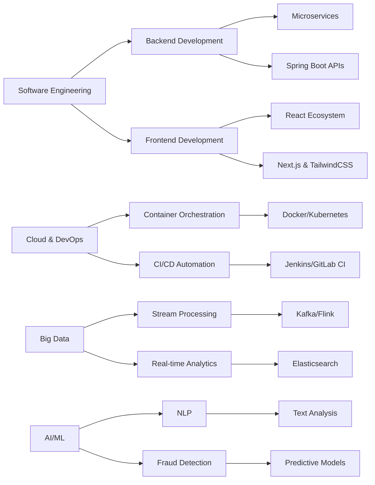

<div align="center">


<p align="center">
  
</p>

<p align="center">
  <a href="mailto:najib.azmi2019@gmail.com">
    
  </a>
  <a href="https://linkedin.com/in/najib-azmi-756096248">
    
  </a>
  <a href="https://github.com/NajibAZMI">
    
  </a>
</p>

<p align="center">
  
  
  
</p>


</div>

<br>

##  About Me

```typescript
class NajibAzmi extends SoftwareEngineer {
  constructor() {
    super();
    this.name = "Najib AZMI";
    this.role = "Software & Cloud DevOps Engineer";
    this.location = "Skhirate-Témara, Morocco 🇲🇦";
    this.education = "ENSAH - Software Engineering (Final Year)";
    this.workingOn = "Building Scalable Cloud-Native & Big Data Systems";
  }

  get expertise() {
    return [
      "Backend Development (Java/Spring Boot, Python/Flask)",
      "Cloud & DevOps (AWS, Azure, Docker, Kubernetes)",
      "Big Data & Streaming (Kafka, Flink, Elasticsearch)",
      "Frontend Development (React.js, Next.js, TailwindCSS)",
      "AI/ML & Data Analysis (TensorFlow, Scikit-learn, NLP)"
    ];
  }

  get currentFocus() {
    return {
      learning: "Advanced Kubernetes orchestration & AWS services",
      projects: "Microservices architecture with hexagonal design",
      bigData: "Real-time data processing with Apache Kafka & Flink",
      devOps: "CI/CD automation with Jenkins & GitLab",
      ai: "NLP applications and fraud detection systems"
    };
  }

  get experience() {
    return [
      {
        company: "Marketing Confort",
        role: "Backend Developer Intern",
        period: "Jul 2025 - Sep 2025",
        tech: ["Spring Boot", "Docker", "Kubernetes", "AWS", "Jenkins"]
      },
      {
        company: "ShiftBricks",
        role: "Backend Developer Intern",
        period: "Jul 2025 - Sep 2025",
        tech: ["Spring Boot", "Azure", "PostgreSQL", "Docker"]
      }
    ];
  }

  get certifications() {
    return {
      cloud: "☁️ Oracle Cloud Database Services 2025 Certified Professional",
      development: "💻 Oracle APEX Cloud Developer Certified Professional"
    };
  }

  getPhilosophy() {
    return "Build scalable systems, automate everything, and never stop learning 🚀";
  }

  get dailyRoutine() {
    return [
      "☕ Coffee",
      "💻 Code",
      "🏗️ Architect",
      "☁️ Deploy to Cloud",
      "📊 Monitor",
      "🔄 Optimize",
      "🎯 Repeat"
    ];
  }
}

const najib = new NajibAzmi();
console.log(najib.getPhilosophy());
```

<div align="center">
  
</div>

<details>
<summary><b>🎯 What I Bring to the Table</b></summary>
<br>

- 🏗️ **Microservices Architecture**: Design and implement scalable Spring Boot microservices with hexagonal architecture
- ☁️ **Cloud Native**: Deploy and manage applications on AWS (EKS, EC2, RDS, S3) and Azure
- 🔄 **DevOps & CI/CD**: Automate deployment pipelines with Jenkins, GitLab CI, and GitHub Actions
- 📊 **Big Data Processing**: Build real-time data pipelines with Apache Kafka and Flink
- 🤖 **AI/ML Integration**: Develop NLP applications and fraud detection systems
- 🎨 **Full-Stack Development**: Create modern web applications with React.js, Next.js, and TailwindCSS
- 🔐 **Security**: Implement JWT authentication, RBAC, and secure API design
- 📈 **Monitoring**: Set up comprehensive monitoring with Prometheus, Grafana, and ELK Stack

</details>

---

## 🛠️ Technology Arsenal

<table align="center">
<tr>
<td valign="top" width="33%">

### 🔧 Backend & Architecture
<p align="center">


</p>

</td>
<td valign="top" width="33%">

### 🎨 Frontend & Modern Web
<p align="center">


</p>

</td>
<td valign="top" width="33%">

### ☁️ Cloud & DevOps
<p align="center">


</p>

</td>
</tr>
<tr>
<td valign="top" width="33%">

### 📊 Big Data & Streaming
<p align="center">


</p>

</td>
<td valign="top" width="33%">

### 🤖 AI & Machine Learning
<p align="center">


</p>

</td>
<td valign="top" width="33%">

### 💾 Databases & Caching
<p align="center">


</p>

</td>
</tr>
<tr>
<td valign="top" width="33%">

### 📈 Monitoring & Testing
<p align="center">


</p>

</td>
<td valign="top" width="33%">

### ⚙️ Low-Code & Automation
<p align="center">


</p>

</td>
<td valign="top" width="33%">

### 🔨 Tools & Practices
<p align="center">


</p>

</td>
</tr>
</table>

<div align="center">

### 📦 Tech Stack Visualization


</div>

---

## 📈 GitHub Analytics

<div align="center">
  


</div>

<div align="center">

[](https://git.io/streak-stats)

</div>

<div align="center">
  


</div>

---

## 🏆 Achievements & Recognition

<div align="center">

[](https://github.com/ryo-ma/github-profile-trophy)

</div>

---

## 🎓 Professional Certifications

<div align="center">

| 🏅 Certification | 🏢 Issuer | 🎯 Focus Area |
|:-----------------|:----------|:--------------|
| **Oracle Cloud Database Services 2025** | Oracle | Cloud Database Management |
| **Oracle APEX Cloud Developer** | Oracle | Low-Code Development |

</div>

---

## 🔥 Featured Projects

<div align="center">

### 🌐 AWS Microservices Deployment (Sep 2025 - Nov 2025)
**Spring Boot microservices on AWS EKS with full DevOps pipeline**
- Deployed on AWS EKS with CI/CD Jenkins automation
- Monitoring with Prometheus & Grafana
- Integration: RDS, S3, ElastiCache
- Frontend: React.js with modern UI

**Tech Stack:** `Spring Boot` `AWS EKS` `Jenkins` `Prometheus` `Grafana` `React.js` `Docker` `Kubernetes`

---

### 🔍 Real-Time Fraud Detection System (Sep 2024 - Jan 2025)
**Big Data application for real-time fraud detection**
- Apache Kafka for event streaming
- Apache Flink for distributed stream processing
- JavaFX interface for monitoring
- PostgreSQL for data persistence

**Tech Stack:** `Apache Kafka` `Apache Flink` `JavaFX` `PostgreSQL` `Docker` `Big Data`

---

### 📝 NLP Annotation Platform (Apr 2025 - Jun 2025)
**Full-stack text analysis application with intelligent annotation**
- Spring Boot backend with hexagonal architecture
- JWT authentication & RBAC
- NLP processing for smart text annotation
- React.js frontend with modern UX

**Tech Stack:** `Spring Boot` `React.js` `PostgreSQL` `JWT` `NLP` `Python`

---

### 📱 Business Management App with PowerApps (Oct 2024 - Nov 2024)
**Low-Code business application for task management**
- Built with Microsoft PowerApps
- SharePoint & Excel integration
- Power Automate workflow automation
- Intuitive user interfaces

**Tech Stack:** `PowerApps` `Power Automate` `SharePoint` `Excel`

</div>

---

## 💡 Core Competencies Matrix



---

## 🌟 Professional Philosophy

<div align="center">

> *"Code with precision, architect with vision, deploy with confidence.*  
> *Build systems that scale, automate everything, and never stop learning."*

</div>

### 🎯 My Approach

<table>
<tr>
<td width="50%">

#### 🏗️ **Architecture First**
- Microservices with hexagonal architecture
- Cloud-native and scalable design patterns
- Clean code and SOLID principles
- API-first development approach

</td>
<td width="50%">

#### ☁️ **Cloud & Automation**
- Infrastructure as Code mindset
- CI/CD pipelines for rapid delivery
- Container orchestration with Kubernetes
- Comprehensive monitoring & observability

</td>
</tr>
<tr>
<td width="50%">

#### 📊 **Data-Driven Solutions**
- Real-time data processing with Kafka & Flink
- Intelligent applications with AI/ML
- Event-driven architectures
- Big Data analytics and visualization

</td>
<td width="50%">

#### 🤝 **Collaboration & Quality**
- Agile/Scrum methodologies
- Test-driven development (TDD)
- Code review and documentation
- Knowledge sharing and mentorship

</td>
</tr>
</table>

---

## 🔗 Let's Connect & Collaborate

<div align="center">

### 💬 Open to Opportunities in

**Backend Development** • **Cloud Architecture** • **DevOps Engineering** • **Big Data Systems** • **Microservices** • **AI/ML Integration** • **Full-Stack Projects**

<br>

[](mailto:najib.azmi2019@gmail.com)
[](https://linkedin.com/in/najib-azmi-756096248)
[](https://github.com/NajibAZMI)
[](https://stackoverflow.com/users/24893399)
[](https://www.leetcode.com/najibazmi)
[](https://www.hackerrank.com/@najib_azmi)

<br>

```javascript
// Let's build something amazing together
const collaborate = async () => {
  if (you.have("an interesting project") || you.need("technical expertise")) {
    await connect("Let's discuss how we can create innovative solutions together");
    return "Looking forward to collaboration! 🚀";
  }
}
```

---


**⚡ "Build scalable systems, automate everything, deploy with confidence" ⚡**

</div>
